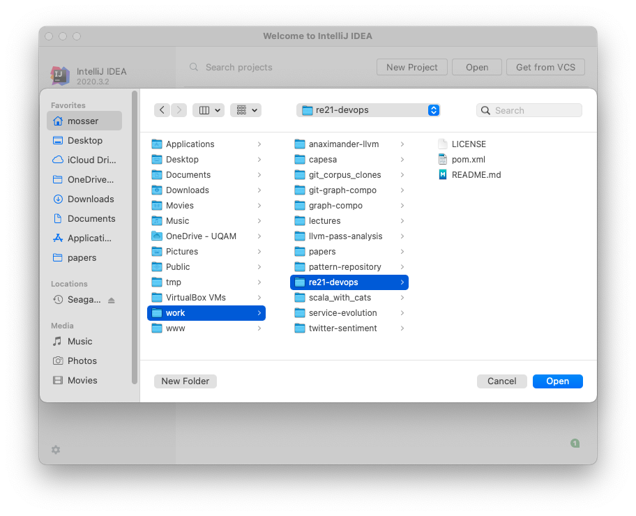

# Act I: Technical environment

## Navigation

  - [Go to summary](../README.md)
  - Go to previous act

## Step I.1: Creating a Maven project

Create a file named `pom.xml`, to store the _Project Object Model_. This file describes in a declarative way what dependencies and build tools we are using in this tutorial. If you prefer an imperative approach, you can use _Gradle_ instead of _Maven_.

```xml
<?xml version="1.0" encoding="UTF-8"?>
<project xmlns="http://maven.apache.org/POM/4.0.0"
         xmlns:xsi="http://www.w3.org/2001/XMLSchema-instance"
         xsi:schemaLocation="http://maven.apache.org/POM/4.0.0
         http://maven.apache.org/maven-v4_0_0.xsd">
    <modelVersion>4.0.0</modelVersion>
    
    <groupId>io.github.ace-lectures</groupId>
    <artifactId>re-21</artifactId>
    <version>1.0-SNAPSHOT</version>
    <name>RE 2021 tutorial</name>
    <packaging>jar</packaging>
    
    <properties>
        <project.build.sourceEncoding>UTF-8</project.build.sourceEncoding>
    </properties>
    
    <build>
        <plugins>
            <plugin>
                <groupId>org.apache.maven.plugins</groupId>
                <artifactId>maven-compiler-plugin</artifactId>
                <version>3.8.1</version>
                <configuration>
                    <source>16</source>
                    <target>16</target>
                </configuration>
            </plugin>
        </plugins>
    </build>
    
</project>
```

The file basically states in an XML (thus verbose) style that we're developing a Java 16 project (`source` & `target`) with UTF-8 files (`encoding`).

We also need to create two directories: `src/main/java` and `src/test/java`, used by Maven as convention for business logic and test code.

```
mosser@loki re21-devops % mkdir -p src/main/java src/test/java 
...
[INFO] ------------------------------------------------------------------------
[INFO] BUILD SUCCESS
[INFO] ------------------------------------------------------------------------
[INFO] Total time:  1.613 s
[INFO] Finished at: 2021-09-19T12:02:00-04:00
[INFO] ------------------------------------------------------------------------
```

## Step I.2: Loading into your favorite IDE

Our project being a Maven project, a _smart_ IDE will recognize the structure and silently import it.



## Step I.3: Create a dumb application

We are going to create a Hello World program just to check that everything is correct.

Create a file named `Main.java` in `src/main/java`, with the following contents:

```java
public class Main {
    public static void main(String[] args) {
        System.out.println("Welcome to this tutorial!");
    }
}
```

To compile the program:

```
mosser@loki re21-devops % mvn clean package
...
[INFO] ------------------------------------------------------------------------
[INFO] BUILD SUCCESS
[INFO] ------------------------------------------------------------------------
[INFO] Total time:  1.613 s
[INFO] Finished at: 2021-09-19T12:02:00-04:00
[INFO] ------------------------------------------------------------------------
```

To execute it we ask Maven to execute the `Main` class. The `-q` flag keeps Maven silent (_quiet_) and avoid printing the logs generated by Mavenn.

```
mosser@loki re21-devops % mvn -q exec:java -Dexec.mainClass=Main
Welcome to this tutorial!
```

We are now ready to talk about requirements engineering & DevOps!

- [Go to next act](./Act_2.md)