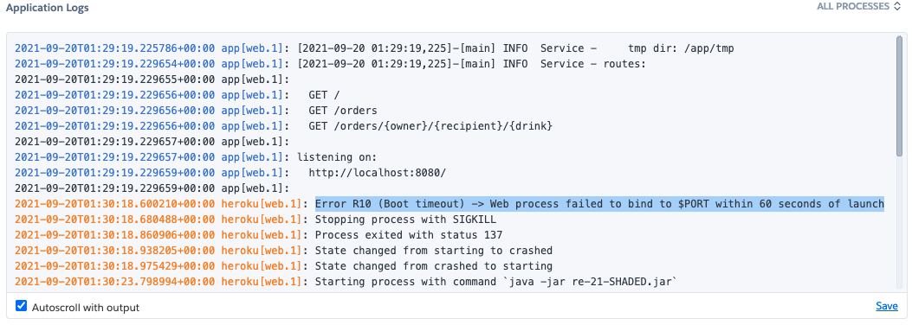

# Pipeline in Action

## Navigation

- [Go to summary](../README.md)
- [Go to previous act](./Act_4.md)


## Step V.1: Witnessing our failure

We can now access to our application on Heroku. Go to the [heroku dashboard](https://dashboard.heroku.com/apps), click on your app and select `Open app`.

Nothing is happening ...

Go back to the previous page, and select `More/View logs`. The application is actually crashing.



We are forcing to use port `8080`, where heroku actually expects to choose a port for us. **The app cannot be deployed this way.**

**Note**: The pipeline cannot know this information, as, from its point of view, the deployment was OK, i.e., Heroku has accepted the image. To support such things, engineers usually deploys _health checks_ in their application, _e.g._, a route answering _OK_ when queried to ensure that the service is up and running. The pipeline contains then an extra step that checks that the helth check is up and running.


Hopefully, we know have a CI/CD pipeline that will support us to fix this mistake.

## Step V.2: Making the Service more flexible

Heroku will select a port for us, and tell us which one using the `PORT` environment variable.

So we have to fix the `Service` class to rely on the environment variable. We add the following instruction in the static initialization block, before the route initialization:

```java
int port = Integer.parseInt(System.getenv().getOrDefault("PORT", "8080"));
setServerOptions(new ServerOptions().setPort(port));
```

So now, the Service will use the port provided in the `PORT` environment variable, or `8080` by default.

## Step V.3: Making the docker image more flexible

We can also fix our Dockerfile to consider the port as a variation point. 

Again, by default, we'll use `8080`, but one should be able to override this setting at the docker level:

```dockerfile
FROM openjdk:16-alpine
ENV PORT=8080
WORKDIR /app
COPY target/re-21-SHADED.jar .
CMD ["java", "-jar", "re-21-SHADED.jar"]
```

## Step V.4: Deploying the Drink Ordering System

We can now add, commit and push to trigger the pipeline.

```
mosser@loki tmp % git add -A; git commit -m "variable port"; git push 
```

The pipeline eventually deploys the app, which will be available at the following URL:

- http://HEROKU_APP_NAME.heroku.com


